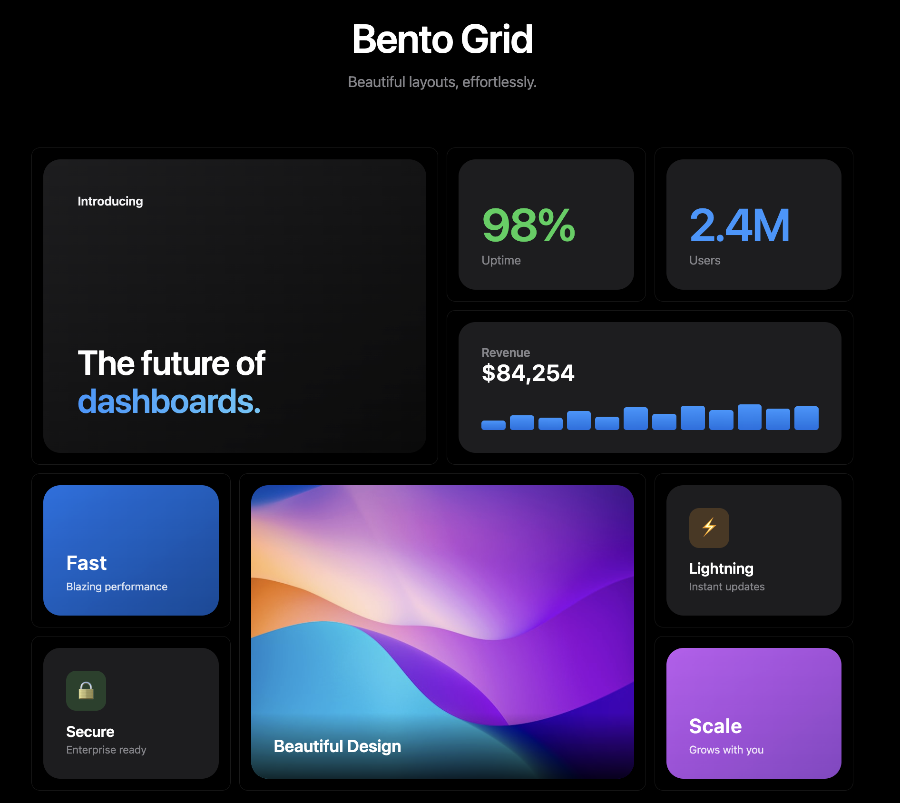

# bento-grid-builder

A flexible, configurable bento grid layout system for React. Create beautiful dashboard layouts with minimal configuration.



## Installation

```bash
npm install bento-grid-builder
```

## Quick Start

```tsx
import { BentoGrid } from "bento-grid-builder";

// Define your card components
const StatsCard = ({ count, label }) => (
  <div>
    <h2>{count}</h2>
    <p>{label}</p>
  </div>
);

const ChartCard = ({ data }) => <MyChart data={data} />;

// Use the grid
function Dashboard() {
  const data = { totalUsers: 1234, chartData: [...] };

  return (
    <BentoGrid
      layout="3x2"
      cards={[
        { id: "stats", component: StatsCard, colSpan: 2 },
        { id: "chart", component: ChartCard },
      ]}
      data={data}
      dataMapping={[
        { cardId: "stats", propsSelector: (d) => ({ count: d.totalUsers, label: "Users" }) },
        { cardId: "chart", propsSelector: (d) => ({ data: d.chartData }) },
      ]}
    />
  );
}
```

## Preset Layouts

Use built-in presets for common layouts:

- `"2x2"` - 2 columns, 2 rows (4 cards)
- `"3x2"` - 3 columns, 2 rows (6 cards)
- `"3x3"` - 3 columns, 3 rows (9 cards)
- `"4x2"` - 4 columns, 2 rows (8 cards)
- `"2x1-hero-left"` - Hero card on left spanning 2 rows
- `"2x1-hero-right"` - Hero card on right spanning 2 rows
- `"dashboard-9"` - 9-card dashboard with mixed spans

```tsx
<BentoGrid
  layout="dashboard-9"
  cards={cards}
  data={data}
  dataMapping={mapping}
/>
```

## Custom Layouts

Define your own layout with full control:

```tsx
const customLayout = {
  columns: 4,
  gap: 16,
  placements: [
    { cardId: "hero", col: 1, row: 1, colSpan: 2, rowSpan: 2 },
    { cardId: "stats1", col: 3, row: 1 },
    { cardId: "stats2", col: 4, row: 1 },
    { cardId: "chart", col: 3, row: 2, colSpan: 2 },
  ],
};

<BentoGrid
  layout={customLayout}
  cards={cards}
  data={data}
  dataMapping={mapping}
/>;
```

## Responsive Layouts

Define different layouts for different viewport widths:

```tsx
<BentoGrid
  layout={{
    default: "2x2", // Mobile
    breakpoints: [
      { minWidth: 768, layout: "3x2" }, // Tablet
      { minWidth: 1024, layout: "4x2" }, // Desktop
    ],
  }}
  cards={cards}
  data={data}
  dataMapping={mapping}
/>
```

Or use the hook directly:

```tsx
import { useResponsiveLayout } from "bento-grid-builder";

const layout = useResponsiveLayout({
  default: "2x2",
  breakpoints: [
    { minWidth: 768, layout: "3x2" },
    { minWidth: 1024, layout: customDesktopLayout },
  ],
});
```

## Layout Builder

Use the fluent API for building layouts:

```tsx
import { layoutBuilder } from "bento-grid-builder";

const layout = layoutBuilder(3)
  .gap(16)
  .place("hero", 1, 1, { colSpan: 2, rowSpan: 2 })
  .place("stats", 3, 1)
  .place("chart", 3, 2)
  .build();
```

## Hooks API

Cleaner syntax with hooks:

```tsx
import {
  BentoGrid,
  useCardDefinitions,
  useDataMapping,
} from "bento-grid-builder";

function Dashboard({ data }) {
  const cards = useCardDefinitions({
    stats: { component: StatsCard, colSpan: 2 },
    chart: { component: ChartCard },
    list: { component: ListCard, rowSpan: 2 },
  });

  const dataMapping = useDataMapping({
    stats: (d) => ({ count: d.total, label: "Items" }),
    chart: (d) => ({ points: d.chartData }),
    list: (d) => ({ items: d.recentItems }),
  });

  return (
    <BentoGrid
      layout="3x2"
      cards={cards}
      data={data}
      dataMapping={dataMapping}
    />
  );
}
```

## Custom Card Wrapper

Override the default card styling:

```tsx
const MyCardWrapper = ({ children, cardId }) => (
  <div className={`my-card my-card--${cardId}`}>{children}</div>
);

<BentoGrid
  layout="3x3"
  cards={cards}
  data={data}
  dataMapping={mapping}
  cardWrapper={MyCardWrapper}
/>;
```

## Styling

The grid uses CSS custom properties for layout, which works seamlessly with both regular CSS and Tailwind CSS.

### CSS Custom Properties

Customize the grid appearance with CSS variables:

```css
.bento-grid {
  --bento-card-bg: #ffffff;
  --bento-card-radius: 12px;
  --bento-card-padding: 16px;
  --bento-card-border: 1px solid #e5e7eb;
}

/* Dark mode */
.dark .bento-grid {
  --bento-card-bg: #1f2937;
  --bento-card-border: 1px solid #374151;
}
```

### Tailwind CSS

Tailwind classes work automatically - no special configuration needed. The grid sets CSS custom properties via inline styles, and Tailwind utility classes override the CSS rules directly:

```tsx
<UnifiedBentoGrid
  layout={layout}
  cards={cards}
  data={data}
  // Tailwind classes override the default grid styles
  className="grid grid-cols-3 gap-4"
  cellClassName="bg-white dark:bg-gray-800 rounded-xl p-4 shadow-sm border border-gray-200"
/>
```

Dynamic classes per card:

```tsx
<UnifiedBentoGrid
  layout={layout}
  cards={cards}
  data={data}
  className="grid grid-cols-3 gap-4"
  cellClassName={(cardId) => {
    if (cardId === "hero")
      return "col-span-2 row-span-2 bg-gradient-to-br from-blue-600 to-purple-600 rounded-xl p-4";
    return "bg-white rounded-xl p-4 border";
  }}
/>
```

Data attributes are added to cells for CSS targeting:

```css
/* Target by card ID */
.bento-cell[data-card-id="hero"] {
  @apply bg-blue-600;
}
```

### Separate Row/Column Gaps

```tsx
const layout = layoutBuilder(3)
  .gap(16) // default for both
  .columnGap(24) // override column gap
  .rowGap(12) // override row gap
  .build();

// Or in config object
const layout = {
  columns: 3,
  gap: 16,
  columnGap: 24,
  rowGap: 12,
  placements: [...],
};
```

Or pass styles directly:

```tsx
<BentoGrid
  layout="3x3"
  cards={cards}
  data={data}
  dataMapping={mapping}
  style={{ maxWidth: 1200, margin: "0 auto" }}
/>
```

## Accessibility

The grid includes built-in accessibility features:

```tsx
<BentoGrid
  layout="3x3"
  cards={cards}
  data={data}
  dataMapping={mapping}
  ariaLabel="Sales dashboard"
/>

// Or reference an external label
<h2 id="dashboard-title">Sales Dashboard</h2>
<BentoGrid
  layout="3x3"
  cards={cards}
  data={data}
  dataMapping={mapping}
  ariaLabelledBy="dashboard-title"
/>
```

## Error Handling

Handle card render errors gracefully:

```tsx
<BentoGrid
  layout="3x3"
  cards={cards}
  data={data}
  dataMapping={mapping}
  onCardError={(cardId, error) => {
    console.error(`Card ${cardId} failed:`, error);
  }}
/>
```

## Loading States

Show loading placeholders for cards (UnifiedBentoGrid only):

```tsx
<UnifiedBentoGrid
  layout="3x2"
  cards={[
    {
      id: "stats",
      component: StatsCard,
      propsSelector: (d) => ({ count: d.total }),
      loading: (d) => d.isLoading, // Function or boolean
    },
    {
      id: "chart",
      component: ChartCard,
      propsSelector: (d) => ({ data: d.chartData }),
      loading: false,
      loadingComponent: CustomSkeleton, // Per-card loading component
    },
  ]}
  data={myData}
  loadingComponent={GlobalSkeleton} // Default for all cards
/>
```

## Animations

Enable fade-in animations for cards:

```tsx
<BentoGrid
  layout="3x3"
  cards={cards}
  data={data}
  dataMapping={mapping}
  animated
  animationDuration={300} // milliseconds
/>
```

Customize animation via CSS:

```css
.bento-grid {
  --bento-animation-duration: 400ms;
}

/* Override the animation entirely */
.bento-cell-animated {
  animation: my-custom-animation 0.5s ease-out;
}
```

## TypeScript

Full TypeScript support with generics:

```tsx
interface MyData {
  users: number;
  chartData: Point[];
}

<BentoGrid<MyData>
  layout="3x2"
  cards={cards}
  data={myData}
  dataMapping={[
    { cardId: "stats", propsSelector: (d) => ({ count: d.users }) },
  ]}
/>;
```

## API Reference

### BentoGrid Props

| Prop          | Type                                     | Description                              |
| ------------- | ---------------------------------------- | ---------------------------------------- |
| `layout`      | `BentoLayoutConfig \| PresetLayoutName`  | Grid layout configuration or preset name |
| `cards`       | `BentoCardDefinition[]`                  | Array of card definitions                |
| `data`        | `TData`                                  | Your data source                         |
| `dataMapping` | `CardDataMapping<TData>[]`               | Maps data to card props                  |
| `className`   | `string`                                 | Additional CSS class                     |
| `style`       | `CSSProperties`                          | Inline styles                            |
| `cardWrapper` | `ComponentType<CardWrapperProps>`        | Custom card wrapper                      |
| `onCardError` | `(cardId: string, error: Error) => void` | Error callback                           |

### BentoCardDefinition

| Property    | Type            | Description               |
| ----------- | --------------- | ------------------------- |
| `id`        | `string`        | Unique card identifier    |
| `component` | `ComponentType` | React component to render |
| `colSpan`   | `number`        | Default column span (1)   |
| `rowSpan`   | `number`        | Default row span (1)      |

### BentoLayoutConfig

| Property     | Type              | Description                                 |
| ------------ | ----------------- | ------------------------------------------- |
| `columns`    | `number`          | Number of grid columns                      |
| `rows`       | `number`          | Number of rows (auto-calculated if omitted) |
| `gap`        | `number`          | Gap between cards in pixels                 |
| `placements` | `CardPlacement[]` | Card positions                              |

## License

MIT
